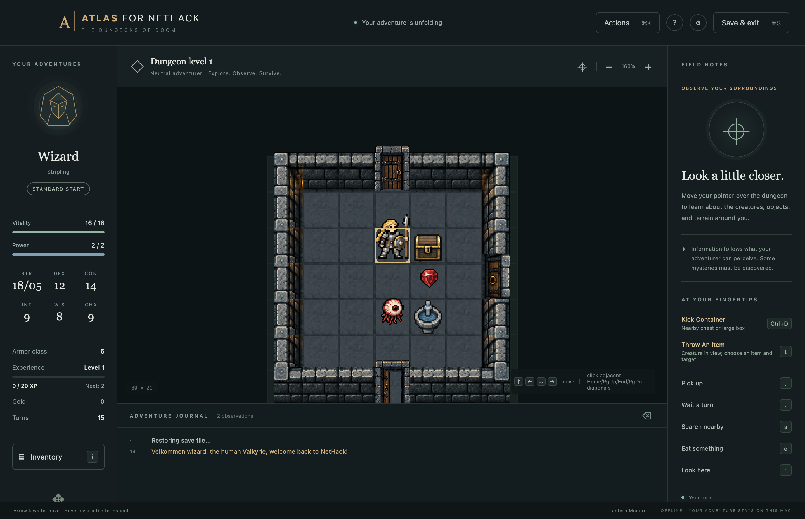
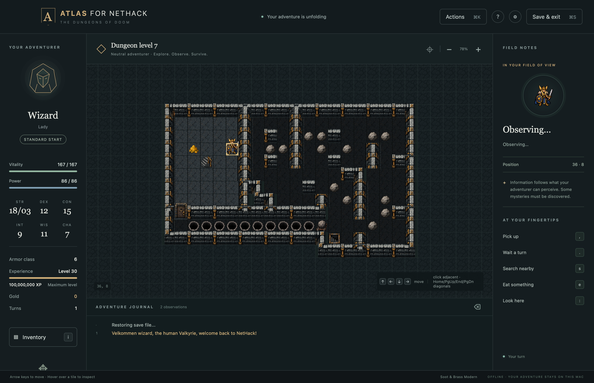

# Atlas for NetHack

**Atlas** is a self-contained macOS desktop application for **NetHack 5.0.0**, with a tiled dungeon, keyboard controls, mouse inspection, native save storage, and a fully offline interface.

Atlas is an independent macOS interface for NetHack. It is not affiliated with or endorsed by the NetHack Development Team.

This project has three goals:

1. Bring the NetHack tileset experience back to modern macOS.
2. Offer optional enhancements to that experience while keeping the NetHack engine authoritative.
3. Serve as a test bed for software development using AI agents.

Atlas was developed from product requirements through a development cycle driven by AI agents. A human stayed in the loop to guide requirements, test and vet the application, review results, and approve product decisions.

The project is provided **as is, without warranty of any kind**. Any use is **at your own risk**. See the [license map](LICENSES.md) and [verification notes](docs/VERIFICATION.md) for terms, tested coverage, and known limitations.

## Screenshots

Captured from Atlas 1.0.0 using disposable developer saves. Only the game view is shown; the Sokoban map is revealed for this example.

**Lantern Modern**: a tiled dungeon with your adventurer, nearby creatures and objects, and contextual actions.



**Soot & Brass Modern**: a Sokoban boulder puzzle with ironwork and dark masonry.



## Play

Download `Atlas-for-NetHack-1.0.0.zip` from [GitHub Releases](https://github.com/atlas-for-nethack/atlas/releases), unzip it, move **Atlas.app** to your Applications folder, and open it. If you prefer to compile the app yourself, follow [Build from source](#build-from-source) below. Generated apps are not included in a Git clone.

This release is not signed with an Apple Developer ID or notarized by Apple. If macOS blocks the first launch, open **System Settings → Privacy & Security**, find the message about Atlas, choose **Open Anyway**, then confirm **Open**. Approve the app only if you trust the download from this repository. See [Apple's instructions](https://support.apple.com/en-us/102445) for details. The build retains an ad hoc integrity signature; it does not establish a verified developer identity.

To check the download, save the ZIP and its matching `Atlas-for-NetHack-1.0.0.zip.sha256` file in the same folder. In Terminal, change to that folder and run:

```sh
shasum -a 256 -c Atlas-for-NetHack-1.0.0.zip.sha256
```

The result should be `Atlas-for-NetHack-1.0.0.zip: OK`. The checksum confirms that your ZIP matches the hash published on the release page; it is not a digital signature or independent proof of who built it. Checksum verification is optional and Terminal is not needed to play.

Once installed, no Homebrew, terminal, server, network connection, or separate NetHack installation is required to play. The default build produces a Universal 2 app containing Apple Silicon and Intel binaries and targeting macOS 13 or later. Gameplay has been tested on Apple Silicon; the Intel build has been compiled and structurally validated but has not been run on Intel hardware.

Atlas includes an optional **Beginner** start. Choose it during character creation to place an unlocked, untrapped supply chest on nearby open floor in the starting room containing 1,000 gold, an identified uncursed magic whistle, two food rations, and an identified uncursed potion of healing. Your role's normal equipment and attributes remain unchanged. Move onto the chest, then use **Loot container** under **At your fingertips** to choose what to take; the Beginner guide remains available during play. Combat, hunger and permanent death follow normal NetHack rules. Standard remains the default.

**Explore** selects NetHack’s native non-scoring discovery mode. It starts with the engine’s wand of wishing and lets you decline death when asked. It uses normal role supplies without the Beginner chest. Explore saves and recovery live separately in `5.0/Explore/`; games do not enter the high-score list. Choose the mode before creating a character; continuing a save preserves that adventure’s mode.

Naming and other modal prompts include **What just happened**, showing the engine’s recent action messages before you answer. Scroll, potion and spellbook effects remain readable while the dialog covers the journal.

Use the arrow keys to move; **y u b n** move diagonally. **i** opens inventory, **s** searches, **comma** picks up items, **period** waits, and **< / >** use stairs. Hover over the map to inspect what your character knows. Click any adjacent tile to move one step, including diagonally. Open **Actions** or press **⌘K** for the complete command list, with live filtering by name, description or shortcut. **At your fingertips** suggests actions for known features underfoot and nearby, including stairs, fountains, containers and creatures. Original NetHack keys remain available.

The Experience bar shows your current level, total XP and the total needed for the next level. Its fill tracks progress within the current level; at level 30 it shows Maximum level.

To name a pet, choose **Name pet**, then **a monster**, and click your pet on the map. You can also move the white selection cursor with arrow keys and press Enter. Escape cancels the selection.

Use **Save** or **⌘S** to save and return to the title screen. Quit also requests a save. Saves, bones, and scores live in `~/Library/Application Support/NetHack Atlas/5.0/`. The Game menu can open that folder.

Beginner adventures keep their saves, bones and scores in the separate `5.0/Beginner/` folder. Saved adventures show their mode, and continuing one preserves that mode. Existing Standard saves stay in their original location. Supplies are created only for a new Beginner adventure, never replenished on save, restore or recovery.

## Build from source

Build on macOS with Apple's [Xcode Command Line Tools](https://developer.apple.com/documentation/xcode/installing-the-command-line-tools) (or full Xcode), Python 3, and an internet connection for the first build. If the command-line tools are not installed, run this in Terminal and finish the installer before continuing:

```sh
xcode-select --install
```

Python 3 is required to build the app.

Copy this repository's clone URL from GitHub's **Code** button and replace `REPOSITORY_URL` below with that URL:

```sh
git clone REPOSITORY_URL atlas-for-nethack
cd atlas-for-nethack
./scripts/build-app.sh
open dist/Atlas.app
```

The build downloads checksum-pinned NetHack and Lua sources, compiles both architectures, packages the maintained artwork and notices, and verifies the completed app. It creates `dist/Atlas.app`; that directory exists only after a build. Engine outputs live under `engine/runtime`. Neither directory is committed to Git.

No additional packages are required for the build. The artwork and icon are already in the repository. Pillow is needed only to regenerate tile assets; Node.js is needed only for the focused JavaScript tests. Later builds can reuse the downloaded source archives.

The engine is a separate C process with a custom window port; it retains the upstream NetHack game rules. Cocoa and system WebKit provide the desktop shell and interface.

The [living NetHack fork record](docs/ENGINE_FORK.md) documents the optional Beginner starting-supply hook, the window-port replacement, dated change notices and the source packaged with each build.

## Development playtests

Build the companion with `./scripts/build-playtest-launcher.sh`, then open
`dist/Atlas Environment Playtests.app` to explore disposable games in the actual
application. Choose a level, layout, tileset and mode; capture local reports with
**Play-test → Report Problem**. See the [developer playtest guide](docs/ENVIRONMENT-PLAYTESTS.md)
for isolation, setup and coverage limits, and the [tileset guide](docs/TILESETS.md)
for current regional rendering behavior.

## Tiles

**Lantern Classic** is the default tileset. **Lantern Modern** retains its architecture with stature-based creature sizing. **Soot & Brass Modern** adds grimdark steampunk artwork, directional iron doors, connected masonry and bars. **Soot & Brass Classic** keeps the same architecture with one-square creatures and items. **NetHack Classic** also remains available in Display settings. Original Lantern and Soot & Brass artwork uses **CC BY 4.0**. Credit: “Lantern and Soot & Brass tilesets by the NetHack Atlas project, licensed under CC BY 4.0.” Include the license link and indicate changes when sharing modified artwork. The [Lantern](assets/tiles/lantern/LICENSE.txt) and [Soot & Brass](assets/tiles/soot-and-brass/LICENSE.txt) artwork notices explain scope and attribution. NetHack Classic and the NetHack-derived catalog retain NGPL only.

See [tileset credits and compatibility](docs/TILESETS.md) for the full notices and source records. Custom PNG/BMP import remains available; sheets must use the 5.0 tile ordering. Dimensions alone cannot establish compatibility, and import does not convert arbitrary older sheets.

To add a shipped tileset, provide one recipe and source atlas, then run
`python3 scripts/build-tilesets.py`. Each selectable tileset owns one PNG;
its name and sprite sizing are independent, and a matching edition is optional.
The [tileset authoring guide](docs/TILESETS.md#authoring-and-rebuilding) explains source
ordering, rendering metadata, licensing, validation and registration.

## Distribution

Project-original Swift/web code, build/test/art tools and Lua executed by Atlas use MIT. Lua loaded inside NetHack uses NGPL. Original artwork, documentation and the icon use CC BY 4.0 under [LICENSE.txt](LICENSE.txt). The short [LICENSES.md](LICENSES.md) maps directories and retains Lua/NetHack notices and tile credits. NetHack and the maintained port retain NGPL; the upstream Lua runtime retains MIT. See the [component inventory](docs/COMPONENT-LICENSES.md) for execution-host boundaries and full notices.

The source build produces an ad-hoc signed app. Developer ID signing and Apple notarization require the distributor's Apple Developer credentials and are not included. An app copied to another Mac may be subject to Gatekeeper checks. The packaged source and licenses accompany the modified NetHack engine; see `Contents/Resources/Source` and the bundled credits.

## Verification

```sh
python3 scripts/test-character-rules.py
python3 scripts/test-engine.py
python3 scripts/test-beginner.py
python3 scripts/test-explore.py
python3 scripts/test-actions.py
python3 scripts/test-context.py
python3 scripts/test-item-menus.py
python3 scripts/test-prompt-messages.py
python3 scripts/test-targeting.py
python3 scripts/test-experience.py
python3 scripts/test-recovery.py
node web/input.test.js
python3 scripts/test-native.py --gender female
python3 scripts/test-native.py --gender male
python3 scripts/test-native.py --mode beginner
python3 scripts/test-native.py --mode explore
python3 scripts/test-prompt-messages.py --native
python3 scripts/test-targeting.py --native
python3 scripts/verify-bundle.py
```

The native test requires a normal logged-in Mac desktop session. It creates disposable saves inside `.artifacts/` and exercises the actual packaged app. Engine tests cover movement, inspection without consuming a turn, inventory, save/restore, quit during prompts, parent disconnect, and crash recovery. See [verification notes](docs/VERIFICATION.md) for scope and remaining limitations.

## Repository hygiene

Contributor and coding-agent guidance lives in [AGENTS.md](AGENTS.md). Commit source, build scripts, documentation and licensed artwork. Generated applications and release archives (`dist/`), build trees, upstream downloads, runtime binaries and test saves are excluded from Git. Distribute application archives as release attachments rather than committing them.

## Implementation

- `native/`: Cocoa application, offline WebKit renderer, process bridge, save directory, menus, and tileset import.
- `web/`: dependency-free game UI and tile canvas.
- `engine/`: custom NetHack window port and runtime output.
- `scripts/`: reproducible engine/application builds and verification.
- `assets/tiles/`: shipped tile sheets, recipes, provenance and license evidence.
- `docs/`: architecture, protocol, artwork, and verification notes.
